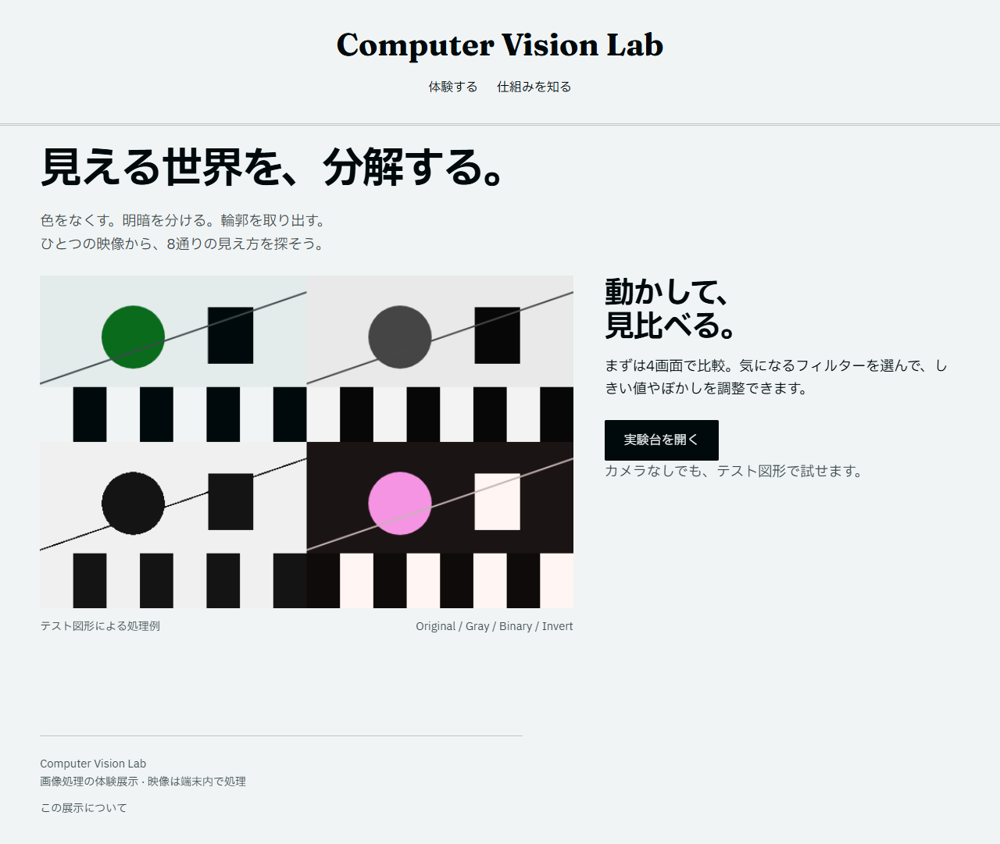

# Computer Vision Lab

カメラ映像にフィルターをかけて、画像処理の違いを見比べる展示です。グレースケール、二値化、Canny、ぼかし、モザイク、色反転、輪郭抽出を試せます。

最初は4画面で比較し、気になった処理を1画面で調整します。カメラがなくてもテスト図形で動きます。処理にはOpenCV.jsを使っています。



## 手元で動かす

GitとNode.js 22を用意して、リポジトリをcloneします。

```sh
git clone https://github.com/kanalia7355/cvlab.git
cd cvlab
npm ci
npm run dev
```

http://localhost:3003 を開いてください。モデルや画像はリポジトリに含めています。再取得するときだけ `npm run assets` を実行します。

カメラ映像は端末内で処理します。HTTPSまたはlocalhostから開き、ブラウザーのカメラ使用を許可してください。

## Vercelに置く

自分のGitHubアカウントにこのリポジトリをForkするか、cloneした内容を自分のリポジトリへpushしてください。VercelにそのGitHubアカウントを連携し、自分のリポジトリをImportします。

このアプリだけを置いたリポジトリなら、Root Directoryは直下です。別のリポジトリのサブフォルダーに置く場合は、このアプリの `package.json` があるフォルダーを指定してください。Next.js、Node.js 22、インストール・ビルドコマンドは設定ファイルに指定済みです。環境変数や外部DBの設定はありません。

推論はブラウザーで動き、モデルとWASMはアプリと同じ配信元から読み込みます。初回表示にはモデルのダウンロード時間がかかります。

```sh
npm run lint
npm run typecheck
npm run build
```

動作確認の範囲は [VALIDATION.md](VALIDATION.md)、ライブラリと素材の出典は [THIRD_PARTY.md](THIRD_PARTY.md) にまとめています。
